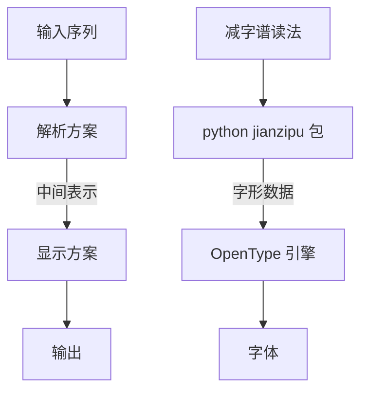

# 天书：减字谱电子化方案

> “妹妹近日越发长进了，竟看起天书来了！”
> “好个念书的人，连个琴谱都没有见过。”

>[!Note]
>我们正在寻找字体设计师或程序开发者加入项目，如果您认同开源精神也是古琴爱好者，欢迎加入我们。

在 [discord](https://discord.gg/UBPK6hnUJD) 上加入讨论！

# 介绍
以往的各种减字谱电子化方案，本质上是预定义的输入字符串与图片格式的减字谱的映射。然而在减字谱被正式编码以前，这些符号要么没有编码（单纯的以图片格式输入），要么编码不统一。然而以 [IRGN2645](https://appsrv.cse.cuhk.edu.hk/~irg/irg/irg61/IRG61.htm) 为代表的减字谱编码方案，其目标在于事无巨细的收录各种古今中外出版物中出现的减字，涉及面太广、审核周期太久，无法满足迫切的使用需求。

经过两年多的探索，我们大致有了一个清晰的、兼顾效率与美观的解决方案：
1. 在设计阶段，我们以减字谱读法为输入形式，通过解析器将其转化为 python 类作为中间表示形式，最后将其编译成 OpenType 字体。
2. 在使用阶段，我们用 Rime 将减字谱读法对应到相应字形。

流程上：左边是抽象步骤，右边是具体实现



本仓库是 monorepo 包括：

1. RIME 减字谱读法输入方案，或者简称为 RIME 减字谱输入方案：这是为了方便快速输入用于解析的减字谱读法
2. jianzipu python 包：用于解析减字谱读法自然语言串
3. 减字谱字体

## RIME 减字谱输入方案：


## 本方案规定的减字谱读法规范

详见 [此处](https://github.com/alephpi/jianzipu/blob/master/dev_guide.md)

# 开发

```bash
git clone git@github.com:alephpi/jianzipu.git
uv sync
```

目前正在开发阶段，可以参考 `scripts/{parse,layout,feature}.ipynb` 与 [开发指南](./dev_guide.md) 了解用法。

# TODO

- [ ] 网页应用
- [ ] 古书印刷
- [X] RIME 输入法
- [ ] 繁体支持

# 参考文献

减字编码相关：
1. 《减字谱指法符号简释》 成公亮辑订
2. 《琴学探微》 龚一
3. [古琴减字谱百科](http://jianzipu.wikidot.com/)
4. [存见古琴指法辑录 查阜西](http://www.silkqin.com/11misc/images/zhadocs/zhazhifa.pdf)
5. http://www.silkqin.com/
6. http://www.unicode.org/L2/L2019/19107-n5041-jianzi-notation.pdf
7. https://unicode.org/L2/L2019/19226-n5074-jianzi-cmt.pdf
8. https://appsrv.cse.cuhk.edu.hk/~irg/irg/irg52/IRGN2372_intro_jianzi.pdf
9. 《古琴艺术的机器演绎》 周昌乐

字体实现：
- https://helpx.adobe.com/cn/fonts/using/open-type-syntax.html#main-pars_header_10
- https://learn.microsoft.com/zh-cn/typography/opentype/spec/gsub
- https://www.bilibili.com/video/BV19E411x7y4/
- https://fontforge.org/en-US/
- https://fontforge.org/docs/scripting/python/fontforge.html
- https://zi-hi.com/GSUB
- https://adobe-type-tools.github.io/afdko/OpenTypeFeatureFileSpecification.html
- https://simoncozens.github.io/fonts-and-layout/features.html
- https://www.bilibili.com/read/cv9204898/

# 致敬

向为古琴数字化工作努力的各位前辈，以及本方案出现前的各类方案致敬。

保留一切权利 润心 2023-至今

All rights reserved alephpi 2023-PRESENT
