## 工具栈

- Figma：用于设计字形并导出 svg
- fonttools：用于编译字体
- 本仓库

## 建议术语 recommended terminology
> 由于减字谱术语标准尚未统一，我推荐使用以下定义。在 issue 或 PR 中请使用以下术语。
1. 一般术语
    - 减字符号（简称为减字或部件）jianzi：由完整汉字的一部分代表整体（如果字形简单则直接以整体表示）的约定俗成的字形，用于记录古琴指法。
    - 减字谱字（简称为谱字或合字）puzi：由若干个减字符号按一定布局组合而成的方块字形，用于记录单音或一组连贯音。
    - 减字谱 jianzipu：由一系列减字谱字排列成的完整的古琴指法谱。
    - 读法 reading：减字符号的读法一般为减字化简以前的字音。减字谱字的读法是减字符号的读法按约定俗成的规则组合而成的汉语短语。
2. 减字类别术语
    - 指法 finger：明确用指。
    - 数字 number：明确弦序或徽位。
    - 修饰 modifier：修饰指法的词，总是依附指法词而不独立出现，如注、绰、慢，用来修饰指法，修饰词可以叠加，如注猱。部分修饰词在谱中以小字出现。
    - 记号 marker：标记节奏、速度及其他。
3. 字体、格式相关
    - 字形 glyph：减字的视觉形象，一减字对应一字形。
    - 字形名 glyph name：字体文件中的唯一标识符，每个字形一个字形名。
    - 字形变体 glyph variant：同一减字在不同体式中发生相应的字形变化。字形变化不包括位置变化。
    - 体式 layout：减字构成谱字的布局，不同成分应该放于什么位置。
4. 读法相关：
    - 语法 syntax：经我和前人著作总结的读法约定俗称的规则。谱字读法可分为四大形式：简单形式、复杂形式、旁注形式、独体形式。每一种语法形式对应一种体式，例如简单形式的谱字的读法对应着简单形式的体式。
5. Figma 相关：
    - 部件 component：从汉字中抽取出来的部分，作为减字字形的具体实现。因为有很多备选项，所以作此区分（例如大可以从“大达夶𠀤规辇椝”中抽取）。负责形状、大小，对应于 Figma 中的 Vector，导出为 SVG。占位符 Placeholder 是一类特殊部件。
    - 布局 layout：负责部件排列的位置，是 Figma 中的 Frame，下辖若干 Vector，导出为 CSS。
    - 命名规范：单独部件无前缀，小驼峰命名法（类别+部件名拼音，数字类别 n，指法类别弦序 x、徽位 h、走位 z），布局以 l_为前缀，在布局下辖的核心部件以 c_为前缀，后接核心部件名。

## 减字谱的语法
### 基本词类

1. 指法词：明确用指的词
2. 数字词：弦序或徽位词
3. 修饰词：修饰指法的词，总是依附指法词而不独立出现，如注、绰、慢，用来修饰指法，修饰词可以叠加，如注猱。部分修饰词在谱中以小字出现。
4. 记号词：标记节奏、速度及其他

下面是一些有效的古琴指法举例：

1. 散音勾三弦
2. 食指七徽勾四弦
3. 大指按九徽绰勾四弦
4. 吟|猱|进|退|进复|退复|撞|往来|分开|泛起|泛止
5. 上|下七徽九分
6. 二上七六 （分两步上到七徽六分）
7. [勾剔|抹挑|轮|慢轮|半轮] 四
8. 历五四
9. 散撮五七
10. 撮大七徽七弦散五弦

### 语法分析树
减字谱读法是一种上下文无关语言，可以归纳为四大类：

1. 简单形式

```
[简单形式 [徽位指法短语 [指法 大指][数字短语 七徽 六分]][修饰短语 注][弦位指法短语 [指法 勾][数字短语 三弦]]]
```

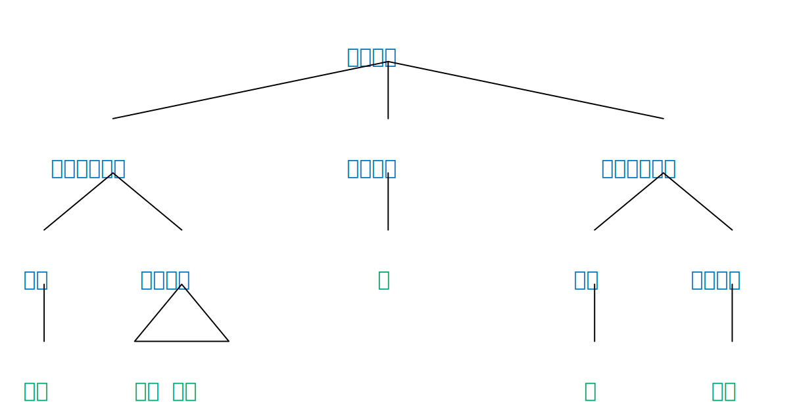

2. 复杂形式/撮式

```
[复杂形式/撮式
  [撮式指法 撮]
  [撮式左子式 [徽位指法短语 [徽位指法 大指][数字短语 七徽 六分]][修饰短语 注][退化弦位指法短语 [数字短语 七弦]]]
  [撮式右子式 [徽位指法短语 [徽位指法 名指][数字短语 六徽 二分]][修饰短语 绰][退化弦位指法短语 [数字短语 五弦]]]
]
```

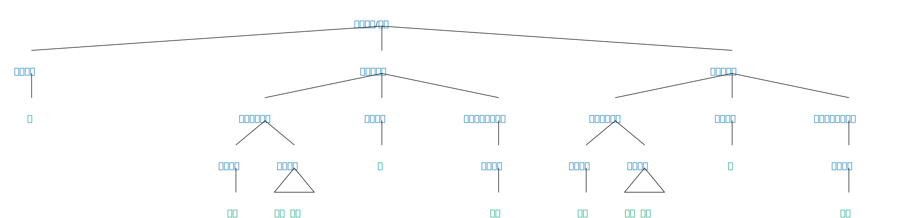

3. 旁注形式

```
[旁注形式 [修饰短语 紧][特殊指法 注][走位指法短语 [指法 上] [数字 七徽六分]]]
```

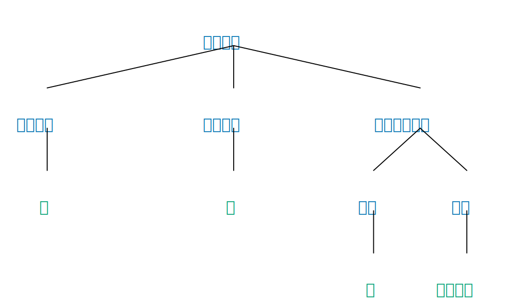

4. 独体形式：包括记号和联袂指法，这些减字符号均可单独成谱字

### 正写与简写

在上述减字谱读法语法规定的基础上，我们可以进一步省略减字谱读法中的“徽、分、弦、指、音”这几个字，譬如“散音勾三弦”、“撮大指七徽七分三弦散音四弦”可以分别简化为“散勾三”、“撮大七七三散四”。

这种简化可能会造成如下歧义：
“大十二勾四”可以被理解为“大指十徽二分勾四弦”或者“大指十二徽勾四弦”，类似的情况还包括十一徽和十三徽。鉴于十徽一分、二分、三分这三个徽位并不常用，我们总是将十一、十二、十三理解为十一徽、十二徽、十三徽。

因此，我们提供正写 `ortho` 和简写 `abbr` 两种输入模式的解析法，以便支持用户在不引发歧义的情况下采用简写方便输入，而在极特殊情况使用正写来消除歧义。同时我们也支持将两种格式的相互转化。

## 字体设计（显示方案）
我们采用 OpenType 字体来呈现减字谱。

### 布局 layout

每类减字谱语法都对应于一类谱字布局（详见 IRGN2645，下称**提案**），而每类谱字布局又可以细分出若干小类，例如提案中分出了六大类：

<table>
    <tr>
        <td>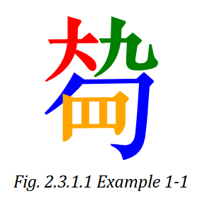</td>
        <td>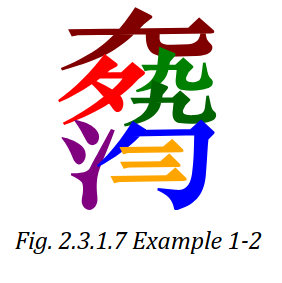</td>
    </tr>
    <tr>
        <td>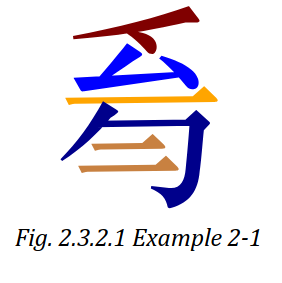</td>
        <td>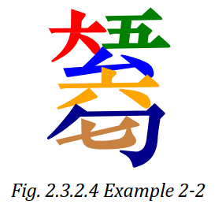</td>
    </tr>
    <tr>
        <td>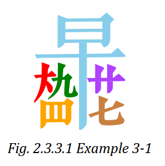</td>
        <td>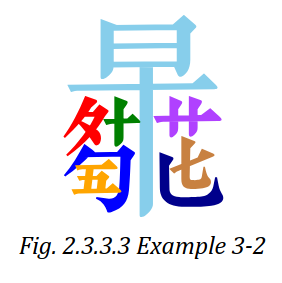</td>
    </tr>
    <tr>
        <td>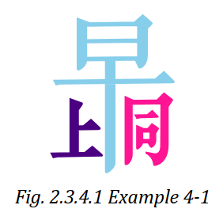</td>
        <td>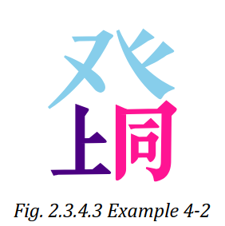</td>
    </tr>
    <tr>
        <td>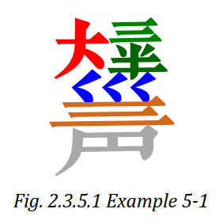</td>
        <td></td>
        <td>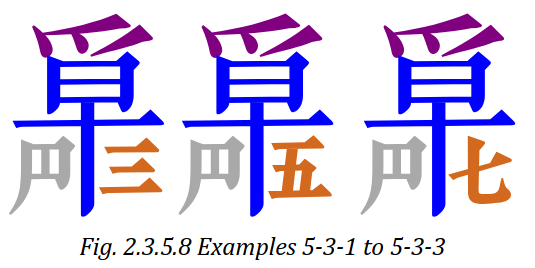</td>
        <td>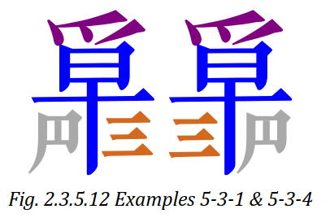</td>
    </tr>
    <tr>
        <td>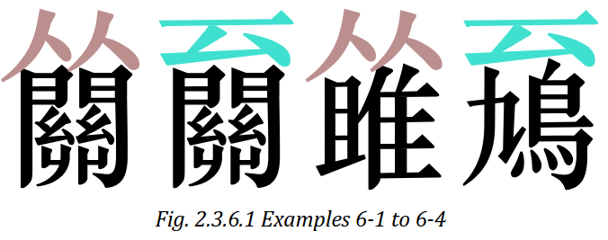</td>
    </tr>
</table>

可以见到这些布局区分的很细，有些布局罕见并不实用，因此不作实现。我们只考虑以下情形：

1. 简式布局
   1. 不带绰注：1-1
   2. 带绰注修饰：1-2（但排除 1-2 例图中的“就”），尤其注意我们将绰也改为左右结构的格局（取绞丝旁），而非传统的上下结构格局。
2. 复式布局：3-1，不考虑 3-2 的冗余情形，不考虑 4-1，4-2 的罕用情形。
3. 旁注布局：本质上是竖排古籍中的夹注，在提案中被区分为 1-5 个字的布局。
4. 独体布局：此类谱字单独收录即可。

提案中的其他未提及的布局不考虑，原因如下：
1. 2-1，2-2：这种在一个谱字中出现两个指法与两个数字的情况，要么是叠蠲这种组合指法，其用指固定，因而其中的勾是冗余，可以处理成蠲一二并入简式布局，要么是滚拂这种允许在中途插入左手指法的，拆成起始的滚/拂几（简式布局），至几（旁注布局）比较合适。
2. 5-1：可并入简式布局
3. 5-2：可并入旁注布局
4. 5-3：可并入复式布局
5. 6：反复记号可以统一为从「 至 」、从「 再作，或干脆以旁注形式呈现。

布局包含两个属性，它由 `LayoutNode` 建模：
1. 名称 name
2. 语法标签 tag
3. 在父布局中的位置与自身大小，是一个 Area 对象，包含 x,y,width,height。
4. 所含子布局 children，这主要是为了方便布局设计与 OpenType feature rule 导出。Nancy 的方案中没有拆分子布局，因而不够灵活，引入子布局就意味着我们可以复用一些基础布局。

以及一个导出 OpenType feature 规则的方法。

确定布局后，每种布局按照语义功能划分为不同区域，对应填入读法中的成分，例如简式布局 1 可以划分为两个区域：徽位指法短语区域和弦序指法短语区域，而每个区域可以进一步划分成徽位指法+数字，弦序指法+数字。这与上面的语法分析树相对应。

<!-- 由于减字布局的递归性，我们引入额外的子布局层级，但是这仅仅用于简化开发使用。 -->

### 字形

解析器将读法分析得到不同成分后，根据成分找到对应字形，以便填入布局的区域。

字形包含四个属性：
1. 编码：字形的唯一 unicode 编码（私有区）
2. 字形名：字形在字体文件中的唯一标识符
3. 字形中文名：因为字体文件不支持中文字符串，故单独列出以方便对照
4. 字形文件：字形的矢量图文件

其中，字形名的命名规范为`<减字拼音名>.<变体后缀>`，例如`yi1`，`yi1.sm`分别表示数字一（用于一般情形）与数字一的小写变体（用于徽分位情形）。

### 解析器

解析器的工作流程是：

1. 输入减字读法序列
2. 将读法序列中的每个成分打上成分标签，并确定减字的布局
3. 按照成分标签找到对应的字形名
4. 输出字形名序列

随后，OpenType 特性将输出的字形名序列按照前面布局生成的规则渲染出谱字。

例如：

1. 输入`大九勾三`
2. 根据读法确定布局为`简式布局`，打标`大`为`徽位指法`，`九`为`一价徽位数字`，`勾`为`弦序指法`，`三`为`一价弦序数字`
3. 根据减字名与成分找到对应字形，即`da4`，`jiu3`，`gou1`，`san1`
4. 输出 `da4 jiu3 gou1 san1`