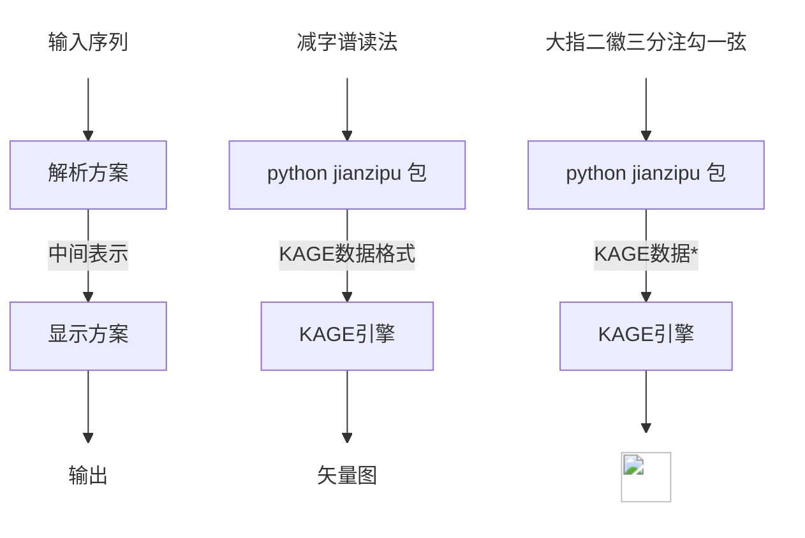

# 减字谱电子化方案

以往的各种减字谱电子化方案，全都基于字面符号。然而在减字谱被正式编码以前，这些符号要么没有编码（单纯的以图片格式输入），要么编码不统一。

本方案的旨在以减字谱的读法为输入形式，并通过解析器将其转化为 python 类作为中间表示形式，方便后续连接不同的显示方案实现。

本方案不同于既往的减字谱输入、编码方案：

1. 本方案是开源免费的。
2. 本方案不寻求建立一套对应于 unicode 的编码方案，即试图穷尽减字并将每个减字对应于一条静态编码。事实上这种尝试没有太大意义：
   - 理论上减字其实是短语范畴，由于语言的无穷性，为短语（字符串）编码是没有意义的
   - 实际上如果能够开发（或者借助现有的）造字引擎，显示方案迎刃而解。这也是问题的关键，是完成输入方案后的难关
3. 本方案不采用减字图片形式的输入方案，如目前市面上常见的丝桐里、广陵神器等。因为本方案的目的是通用性。这些输入方案通常内嵌于相应程序，本质上是一种输入方案的实现。而本方案着重描述一种抽象方案，并提供一种可能的程序实现。此外，由于本方案的后续工作是显示方案，使用减字图片不符合本项目的逻辑。使用减字图片为输入形式的方案，输入逻辑通常是分类索引，需要在眼花缭乱的减字图片备选项中找到目标，况且这些图片有时可能有缺漏。因此我们采用减字谱读法作为输入形式更方便且通用。

流程上：左边是抽象步骤，中间是具体实现，右边是示例



<details>
<summary>*:具体渲染数据为：</summary>
1:0:0:11.2:28.0:77.6:28.0:nan:nan:nan:nan$2:0:7:41.6:5.6:44.0:54.8:11.2:75.2:nan:nan$2:7:8:40.0:32.4:60.0:44.8:69.6:63.2:nan:nan$1:0:0:99.2:9.6:180.8:9.6:nan:nan:nan:nan$1:0:0:88.4:30.8:191.6:30.8:nan:nan:nan:nan$1:0:0:95.0:47.8:185.0:47.8:nan:nan:nan:nan$1:0:0:105.2:59.8:174.8:59.8:nan:nan:nan:nan$1:0:0:88.4:72.6:191.6:72.6:nan:nan:nan:nan$2:7:8:26.04:79.4:47.04:84.09:56.28:93.47:nan:nan$2:7:8:10.08:110.22:32.76:114.91:41.16:124.28999999999999:nan:nan$2:7:8:11.76:155.11:41.16:161.14:37.8:189.28:nan:nan$2:32:7:33.6:166.5:36.96:158.45999999999998:72.24:110.89:nan:nan$2:0:7:101.3:77.39:94.3:112.9:71.2:140.37:nan:nan$1:0:2:95.0:98.16:181.8:98.16:nan:nan:nan:nan$2:22:4:181.8:98.16:177.6:167.17000000000002:162.9:187.94:nan:nan$1:0:0:96.386:139.08695:165.01399999999998:139.08695:nan:nan:nan:nan

</details>
本仓库是 monorepo 包括：

1. RIME 减字谱读法输入方案，或者简称为 RIME 减字谱输入方案：这是为了方便快速输入用于解析的减字谱读法。
2. jianzipu 包：用于解析减字谱读法自然语言串
3. 减字谱显示方案：[KAGE engine](https://github.com/kurgm/kage-engine)

# 使用

```
pip install jianzipu
```

# 开发

## 克隆、安装依赖

```bash
git clone git@github.com:alephpi/jianzipu.git
```

使用你偏爱的包管理工具创建虚拟环境，进入 `package/jianzipu`文件夹，执行 `poetry install`

- `showcase.ipynb` 用于展示 api
- `pytest test.py`进行单元测试

# 参考文献

减字编码相关：

1. 《减字谱指法符号简释》 成公亮辑订
2. 《琴学探微》 龚一
3. [古琴减字谱百科](http://jianzipu.wikidot.com/)
4. [存见古琴指法辑录 查阜西](http://www.silkqin.com/11misc/images/zhadocs/zhazhifa.pdf)
5. http://www.silkqin.com/
6. http://www.unicode.org/L2/L2019/19107-n5041-jianzi-notation.pdf
7. https://unicode.org/L2/L2019/19226-n5074-jianzi-cmt.pdf
8. https://appsrv.cse.cuhk.edu.hk/~irg/irg/irg52/IRGN2372_intro_jianzi.pdf
9. 《古琴艺术的机器演绎》 周昌乐

字体实现：

1. [KAGE engine](https://github.com/kurgm/kage-engine)
2. [字统网](https://zi.tools/)

# 致敬

向为古琴数字化工作努力的各位前辈，以及本方案出现前的各类方案致敬。

保留一切权利 润心 2023-至今

All rights reserved alephpi 2023-PRESENT
